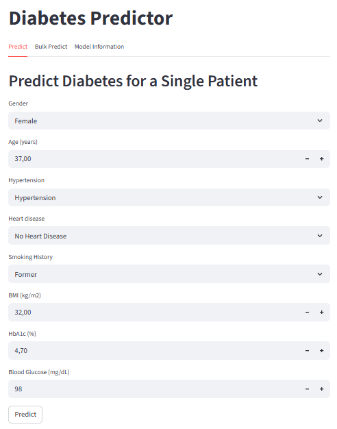

# Diabetes Prediction Project

## Overview
This project is a diabetes prediction application using machine learning. The goal is to predict the risk of diabetes based on patient clinical features. The project includes:
- Data **exploration** and **preprocessing**
- Training a **Logistic Regression** model with a sklearn pipeline
- Interactive predictions through a **Streamlit web application**
- Ability to perform **single** or **bulk predictions**

This project is intended as a hands-on example of an **end-to-end ML workflow** including reproducible code and a simple UI.

## Project Structure

```graphql
diabetes-prediction/
├── app/
│   └── app.py                  # Streamlit web application
├── data/
│   └── diabetes_prediction_dataset.csv
├── models/
│   └── model.pkl
├── src/
│   ├── config.py               # Project configuration
│   ├── data.py                 # Load and split dataset
│   ├── model.py                # Define preprocessing + ML pipeline
│   ├── train.py                # Train model and save pipeline
├── exploration.ipynb           # EDA notebook
├── requirements.txt            # Python dependencies
├── README.md
└── diabetes_predictor_web.png  # Image of web overview
```
## Installation
### 1. Clone the repository
```bash
git clone https://github.com/basmaele/diabetes-prediction.git
cd diabetes-prediction
```
### 2. Install dependencies
```bash
pip install -r requirements.txt
```
**Note:** Using a virtual environment is optional but recommended for avoiding conflicts with other Python packages.

## Dataset
The dataset used in this project can be found on Kaggle: [Diabetes Prediction Dataset](https://www.kaggle.com/datasets/iammustafatz/diabetes-prediction-dataset)

Place the CSV file in:
```bash
data/diabetes_prediction_dataset.csv
```

## Usage
### 1. Train the model

Run the training script to create the model pipeline and save it to models/model.pkl:
```bash
python -m src.train
```
This will:

- Load the dataset
- Split into train/test sets
- Train a Logistic Regression model
- Save the full pipeline including preprocessing

### 2. Launch the Streamlit Web App

Here is a screenshot of the web app interface:




The app allows interactive predictions:
```bash
streamlit run app/app.py
```

Features:

- **Predict tab:** Single patient prediction
- **Bulk Predict tab:** Upload a CSV file to predict multiple patients at once
- **Model Information tab:** Show model type, pipeline steps, and features

## Notes

- Ensure categorical inputs match the training dataset values exactly, e.g., "No Info" not "No info".
- The pipeline includes preprocessing (OneHotEncoder, StandardScaler), so inputs can be passed directly to the model.
- The model is reproducible using the random seed defined in config.py.